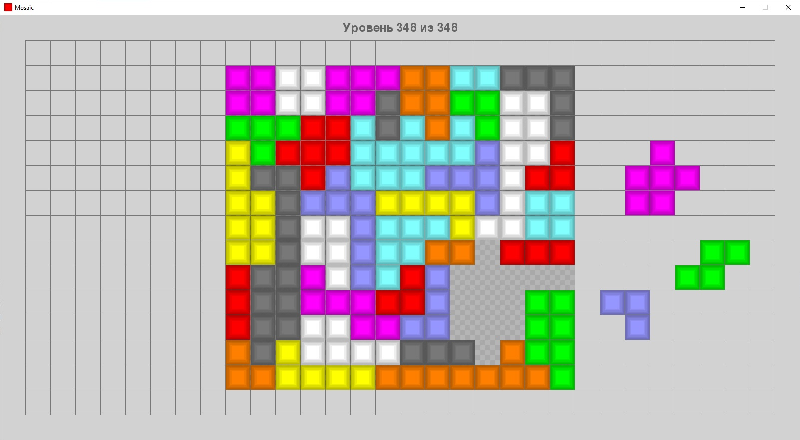
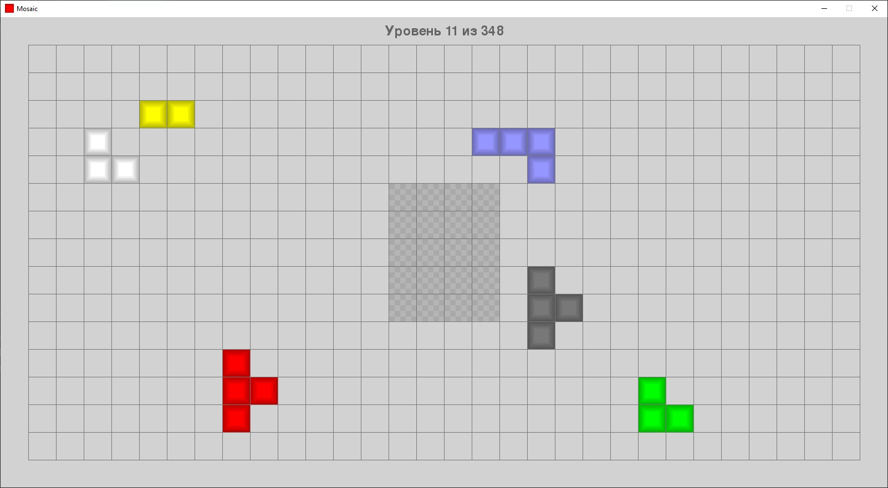
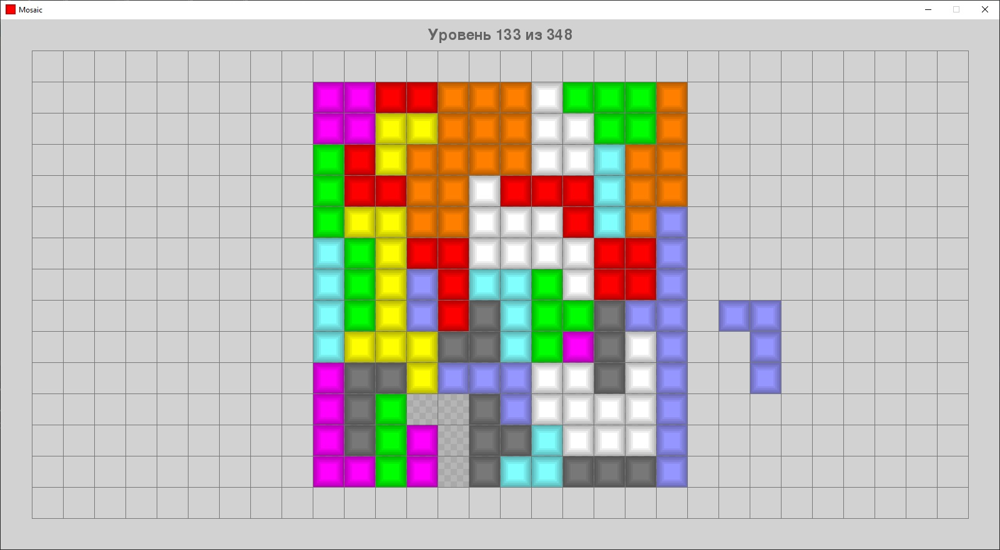
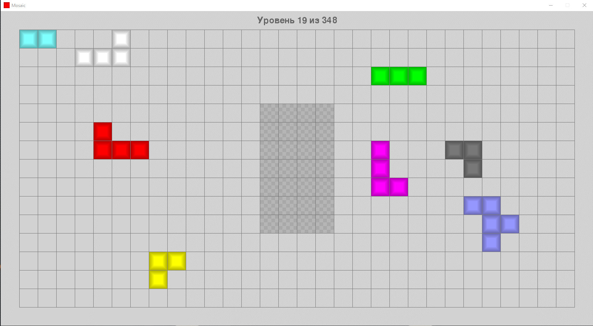

# Mosaic

Простая игра на базе библиотеки pygame. Суть игры в том, чтобы с помощью мышки, перетаскивая и поворачивая фигруы полимино собрать их в прямоугольник в центре игрового поля. Все данные для игры (уровни и спрайты) генерируются процедурно. Для удобства код разбит на 4 файла: start (запускает игру), classes (классы для хранения основных объектов - отдельных  мономино, полимино, класс для поддержки drag'n'drop и генерирования/загрузки уровней), utils (вспомогательные функции) и settings (настройки).
При закрытии окна игра сохраняет текущее состояние в файл save_data.txt, а при открытии - пытается прочитать данные из этого файла. И если это ей удается - продолжает с прерванного уровня (положение фигур на доске восстанавливается таким, каким оно и было).

Игра простетирована на Windows 10 x64 и python 3.7.3

